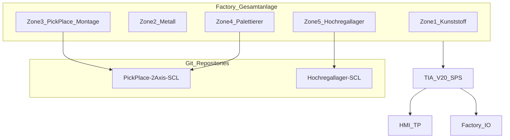

# Abschlussprojekt — Master-Index

**Thema (Freigabe):** Entwicklung und Simulation einer automatisierten Fertigungs- und Lageranlage mit RFID-gestützter Produktverfolgung in TIA Portal und Factory I/O  

**Teilnehmer:** Dereje Hailemariam  
**Ort / Datum Freigabe:** Berlin, 29.06.2026  
**Freigabe:** ja  
**Tools:** TIA Portal V20 · Factory I/O · HMI (TP)

**Untertitel (Gesamtanlage):** Automatisierte Produktions-, Montage- und Lagerverwaltungsanlage für Kunststoff- und Metallprodukte mit RFID-Identifikation

---

## Arbeitsweise

Dokumente und Code werden **einzeln** geliefert und hier eingeordnet:

| Lieferung | Ablage |
|---|---|
| Projekt / Freigabe / Lastenheft | `docs/00_Projekt/` |
| Sicherheit / Risiko / CE | `docs/01_Sicherheit/`, später `docs/04_CE_Dokumentation/` |
| SPS-Architektur, Netzwerk, E/A | `docs/02_Technik/` |
| Subsysteme (Code-Repos) | `docs/03_Subsysteme/` + jeweiliges Git-Repository |

---

## Factory — Repositories (Subsysteme)

Die Gesamtanlage besteht aus **mehreren Repositories**, die zusammen die Factory I/O / TIA-Lösung bilden:

| Zone | Subsystem | Repository (lokal) | Status |
|---|---|---|---|
| **3** | Two-Axis Pick & Place (Montage Base/Deckel) | `../PickPlace-2Axis-SCL` → `scl/PickPlace_DigitalAnalog.scl` | vorhanden |
| **4** | Palettierer | `../PickPlace-2Axis-SCL` → `scl/FB_Palletizer.scl` | vorhanden |
| **5** | Hochregallager + Lagerverwaltung | `../Hochregallager-SCL` | vorhanden |
| 1 | Kunststoffbearbeitung | *folgt* | geplant |
| 2 | Metallbearbeitung | *folgt* | geplant |
| — | RFID / Fördertechnik / HMI Gesamt | *folgt / verteilt* | geplant |

Detailseiten:

- [Palettierer (Zone 4)](../03_Subsysteme/Palettierer/README.md)
- [Two-Axis Pick & Place (Zone 3)](../03_Subsysteme/PickPlace_2Axis/README.md)
- [Hochregallager (Zone 5)](../03_Subsysteme/Hochregallager/README.md)

---

## Phasenübersicht (EN ISO 12100 / Projektablauf)

| Phase | Inhalt | Dokument | Status |
|---|---|---|---|
| 1 | Projektorganisation | [01_Projektorganisation.md](01_Projektorganisation.md) | aktiv |
| 2 | Grenzen der Maschine | [02_Maschinengrenzen.md](02_Maschinengrenzen.md) | aktiv |
| 3 | Bestimmungsgemäße Verwendung | [03_Bestimmungsgemaesse_Verwendung.md](03_Bestimmungsgemaesse_Verwendung.md) | aktiv |
| 4 | Lebensphasen | `01_Sicherheit/` | Stub |
| 5 | Gefährdungsanalyse | `01_Sicherheit/` | Stub |
| 6 | Risikoeinschätzung (PL) | `01_Sicherheit/` | Stub |
| 7 | Sicherheitsstrategie (Zonen) | [../01_Sicherheit/README.md](../01_Sicherheit/README.md) | Stub |
| 8 | Schutzziele | `01_Sicherheit/` | Stub |
| 9 | Schutzmaßnahmen | `01_Sicherheit/` | Stub |
| 10 | Restrisiken | `01_Sicherheit/` | Stub |
| 11 | Sicherheitskontrollen / Prüfprotokolle | `01_Sicherheit/` | Stub |
| 12 | Konformität & Gesamtdokumentation | `04_CE_Dokumentation/` | Stub |

---

## Lieferobjekte (Checkliste Phase 12)

- [ ] Projektbeschreibung  
- [x] Freigabedokument (Thema genehmigt)  
- [ ] Lastenheft  
- [ ] Pflichtenheft  
- [ ] Funktionsbeschreibung  
- [ ] Anlagenübersicht  
- [ ] E/A-Liste (gesamt)  
- [ ] Netzwerkstruktur (Profinet)  
- [ ] SPS-Architektur  
- [ ] Zustandsdiagramme  
- [x] SCL-Bausteine Palettierer (`PickPlace-2Axis-SCL`)  
- [x] SCL-Bausteine Pick & Place (`PickPlace-2Axis-SCL`)  
- [x] SCL-Bausteine Hochregallager (`Hochregallager-SCL`)  
- [x] HMI-Konzept Palettierer  
- [ ] RFID-Konzept  
- [ ] Lagerverwaltung (Gesamtdoku / Integration)  
- [ ] Sicherheitskonzept EN ISO 12100  
- [ ] Risikobeurteilung  
- [ ] Performance-Level EN ISO 13849-1  
- [ ] Betriebsanleitung  
- [ ] Wartungsanleitung  
- [ ] Inbetriebnahme-/Test-/Abnahmeprotokolle  
- [ ] Technische Dokumentation zur CE-Konformitätserklärung  

---

## Freigabe-Referenz

| Feld | Inhalt |
|---|---|
| Offizielles Thema | s. oben |
| Ausgangslage | Rohteile → Fördertechnik → Metall/Kunststoff (Base/Deckel) → RFID → Montage → Palettierung → Ein-/Auslagerung |
| Ziel | Funktionsfähige SPS + übersichtliche HMI; modular, in TIA + Factory I/O testbar |
| Vorgehen | Layout/Signale → Bausteine → Lager-DB → HMI → Simulation → Sicherheit/Doku |

Originaldatei: nach Möglichkeit unter `docs/00_Projekt/Freigabedokument_Abschlussarbeit_Dereje_Hailemariam.docx` ablegen.
