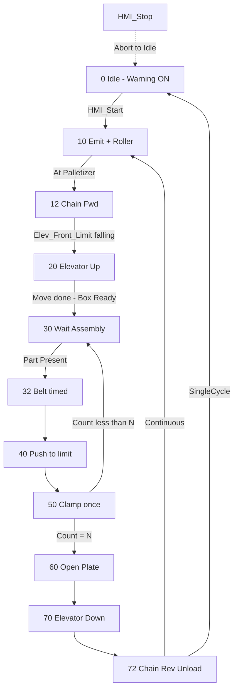

# Palletizer — Full Documentation

**Project:** PickPlace-2Axis-SCL / Factory I/O Palletizer  
**Author:** Dereje Hailemariam  
**PLC language:** SCL (Siemens TIA Portal)  
**FB version:** 2.1  
**Date:** 04.08.2026  

---

## 1. Overview

This project controls a **Factory I/O Palletizer** station that:

1. Emits and loads an empty **stackable box** onto the palletizer elevator  
2. Raises the elevator to the load position  
3. Feeds **assembled parts** via belt → push → clamp (**twice** by default)  
4. Opens the plate to drop the layer into the box  
5. Lowers the elevator and **unloads** the filled box  

Control is available in **Automatic** (sequencer) and **Manual** (HMI jog) modes.

### Station technical data (Factory I/O)

| Parameter | Value |
|---|---|
| Pusher stroke | 0.88 m |
| Elevator stroke | 1.75 m |
| Elevator speed | 2 m/s |

---

## 2. Repository files

| Path | Description |
|---|---|
| `scl/FB_Palletizer.scl` | Main function block — sequence + HMI |
| `scl/UDT_Palletizer.scl` | Optional flat UDT of all variables |
| `scl/PLC_Tags_Palletizer.csv` | PLC tag table (Name; DataType; Address) |
| `scl/PLC_Tags_Palletizer_3col.csv` | Same 3-column CSV (if main file was locked) |
| `scl/PLC_Tags_Palletizer.xlsx` | Excel tag list (3 columns) |
| `scl/make_tags_xlsx.py` | Helper to rebuild the Excel from CSV |
| `scl/PickPlace_DigitalAnalog.scl` | Separate Two-Axis Pick & Place FB (legacy / other station) |
| `docs/Palletizer_Dokumentation.md` | This document |
| `docs/HMI_Palletizer_Organization.md` | HMI screen / tag organization |
| `README.md` | Short project index |

---

## 3. Architecture

```
┌─────────────┐     HMI tags (%M)      ┌──────────────────┐
│  WinCC /    │ ◄────────────────────► │  FB_Palletizer   │
│  Comfort    │   Start/Stop/Jog/Lamps │  (Instance DB)   │
└─────────────┘                        └────────┬─────────┘
                                                │
                    Sensors %I / Actuators %Q   │
                                                ▼
                                       ┌──────────────────┐
                                       │   Factory I/O    │
                                       │   Palletizer +   │
                                       │   Emitters / CV  │
                                       └──────────────────┘
```

**Typical TIA layout**

1. Import PLC tags from CSV/Excel  
2. External source import `FB_Palletizer.scl`  
3. Create instance DB (e.g. `FB_Palletizer_DB`)  
4. Call FB from OB1; wire tags ↔ FB pins  
5. Map Factory I/O driver to the same `%I` / `%Q` addresses  

---

## 4. Process sequence

### 4.1 Step overview

| Step | Name | Action |
|---|---|---|
| **0** | Idle / Initialize | Auto ready: `Warning_Light = TRUE`. Wait for `HMI_Start`. |
| **10** | Emit + roller | `Emit_Stackable_Box`; if box present → `Roller_Conveyor` until `Stackable_Box_At_Palletizer`. |
| **12** | Chain load | `Chain_Fwd` until `Elev_Front_Limit` goes **TRUE → FALSE** (Lichtschrank / light barrier). |
| **20** | Elevator up | `Elevator_Up` + `Move_To_Limit` until `Elevator_Moving` falling edge → `Stackable_Box_Ready`. |
| **30** | Wait assembly | Wait `Assembled_Part_Present` **AND** `Stackable_Box_Ready`. |
| **32** | Belt feed | `Belt_Fwd` for `Belt_Run_Time` (default 1.5 s). |
| **40** | Push | `Push` until `Pusher_Limit` rising edge. |
| **50** | Clamp | `Clamp` until `Clamped`; increment `Assembly_Count`. If count &lt; `Assemblies_Per_Layer` → **30**, else → **60**. |
| **60** | Open plate | `Open_Plate` for `Plate_Open_Time` (while plate not closed). |
| **70** | Elevator down | `Elevator_Down` + `Move_To_Limit` until move ends. |
| **72** | Unload | `Chain_Rev` for `Unload_Time` (or until presence clears). Then Done / next cycle. |

### 4.2 Flowchart



### 4.3 Continuous vs single cycle

| `HMI_SingleCycle` | After step 72 |
|---|---|
| `FALSE` | `Done` cleared, return to step **10** (next box) |
| `TRUE` | `Done = TRUE`, `Auto_Run` off, return to step **0** |

---

## 5. HMI

### 5.1 Operator commands

| Object | Tag | Behaviour |
|---|---|---|
| Start | `HMI_Start` | Rising edge starts auto cycle from step 0 |
| Stop | `HMI_Stop` | Aborts sequence, clears actuators, Idle |
| Reset | `HMI_Reset` | Clears `Done` and `HMI_Cycle_Count` |
| Auto / Manual | `HMI_Auto` | `1` = Automatic sequencer, `0` = Manual jog |
| Single cycle | `HMI_SingleCycle` | Stop after one unload |

### 5.2 Manual jog (`HMI_Auto = 0`)

Held buttons drive actuators directly (opposing directions interlocked):

| Button | Tag |
|---|---|
| Emit stackable box | `Man_Emit_Stackable_Box` |
| Roller conveyor | `Man_Roller_Conveyor` |
| Push / Turn / Clamp | `Man_Push` / `Man_Turn` / `Man_Clamp` |
| Belt + / − | `Man_Belt_Fwd` / `Man_Belt_Rev` |
| Chain + / − | `Man_Chain_Fwd` / `Man_Chain_Rev` |
| Open plate | `Man_Open_Plate` |
| Elevator + / − | `Man_Elevator_Up` / `Man_Elevator_Down` |
| Move to limit | `Man_Move_To_Limit` |
| Warning light | `Man_Warning_Light` |

### 5.3 Status lamps and displays

| Object | Tag | Meaning |
|---|---|---|
| Ready (green) | `HMI_Lamp_Ready` | Auto idle, can Start |
| Running (yellow) | `HMI_Lamp_Running` | Sequence active |
| Done (blue) | `HMI_Lamp_Done` | Last cycle finished |
| Stopped (red) | `HMI_Lamp_Stopped` | Stop active |
| Auto / Manual | `HMI_Lamp_Auto` / `HMI_Lamp_Manual` | Mode feedback |
| Step text | `HMI_Step_Text_ID` | Bind to WinCC text list |
| Cycle counter | `HMI_Cycle_Count` | Completed unloads |
| Assembly count | `Assembly_Count` | Parts in current layer (0…N) |
| State | `State` | Numeric step (same as `HMI_Step_Text_ID`) |

### 5.4 WinCC text list (`HMI_Step_Text_ID`)

| Value | Text |
|---|---|
| 0 | Idle |
| 10 | Emit / roller |
| 12 | Chain load |
| 20 | Elevator up |
| 30 | Wait assembly |
| 32 | Belt feed |
| 40 | Push |
| 50 | Clamp |
| 60 | Open plate |
| 70 | Elevator down |
| 72 | Unload |

### 5.5 Suggested HMI screens

> **Full HMI organization** (layouts, tag groups, enable rules, binding checklist):  
> [`docs/HMI_Palletizer_Organization.md`](HMI_Palletizer_Organization.md)

| Screen | Content |
|---|---|
| **Header** | Mode, lamps, step text, global STOP |
| **Auto** | Start / Reset / SingleCycle / counters / status |
| **Manual** | Jog by zone (Infeed / Layer / Elevator) + sensors |
| **Recipe** | Times + assemblies per layer |
| **Diagnostics** | Busy/Done + raw sensors/actuators |
---

## 6. Recipe parameters

| Parameter | FB / tag | Default | Description |
|---|---|---|---|
| `Belt_Run_Time` | Time | `T#1S500MS` | How long belt runs before push |
| `Plate_Open_Time` | Time | `T#1S` | Plate open dwell |
| `Unload_Time` | Time | `T#3S` | Chain reverse unload duration |
| `Assemblies_Per_Layer` | Int | `2` | Push+clamp repeats per box |

Bind these to HMI I/O fields (writeable) so operators can tune without recompile.

---

## 7. FB interface (`FB_Palletizer`)

### 7.1 Inputs

| Pin | Type | Group |
|---|---|---|
| `HMI_Start`, `HMI_Stop`, `HMI_Reset`, `HMI_Auto`, `HMI_SingleCycle` | Bool | HMI commands |
| `Man_*` (14 pins) | Bool | Manual jog |
| `Stackable_Box_Present`, `Stackable_Box_At_Palletizer` | Bool | Box path sensors |
| `Assembled_Part_Present` | Bool | Assembly infeed |
| `Clamped`, `Plate_Limit`, `Pusher_Limit` | Bool | Station sensors |
| `Elevator_Moving`, `Elev_Back_Limit`, `Elev_Front_Limit` | Bool | Elevator sensors |
| `Belt_Run_Time`, `Plate_Open_Time`, `Unload_Time` | Time | Recipe |
| `Assemblies_Per_Layer` | Int | Recipe |

### 7.2 Outputs

| Pin | Type | Group |
|---|---|---|
| `Warning_Light`, `Emit_Stackable_Box`, `Roller_Conveyor` | Bool | Scene actuators |
| `Push`, `Turn`, `Clamp`, `Belt_Fwd/Rev`, `Chain_Fwd/Rev` | Bool | Station |
| `Open_Plate`, `Elevator_Up/Down`, `Move_To_Limit` | Bool | Station |
| `Stackable_Box_Ready`, `Loading_Box_Active` | Bool | Status (`FALSE` init) |
| `Busy`, `Done` | Bool | Status (`FALSE` init) |
| `State`, `Assembly_Count` | Int | Status (`0` init) |
| `HMI_Lamp_*`, `HMI_Cycle_Count`, `HMI_Step_Text_ID` | Bool / Int | HMI feedback |

### 7.3 Internal (VAR)

| Symbol | Purpose |
|---|---|
| `Auto_Run` | Latched run flag from Start |
| `Step` / `Step_Old` | Sequencer + timer restart on change |
| `R_Start`, `R_Reset`, `R_PusherLimit` | Rising-edge detectors |
| `F_ElevFront`, `F_ElevMoving` | Falling-edge detectors |
| `TON_Belt`, `TON_Plate`, `TON_Unload` | Step timers |
| `ElevFront_WasTrue` | Arms Lichtschrank falling-edge after TRUE seen |
| `Cycle_Count` | Internal cycle counter |

---

## 8. PLC tag address map

Import from `scl/PLC_Tags_Palletizer.csv` or `.xlsx`  
Columns: **Name** · **DataType** · **LogicalAddress**

### 8.1 Sensors (`%I`)

| Name | Type | Address |
|---|---|---|
| Stackable_Box_Present | Bool | `%I6.1` |
| Stackable_Box_At_Palletizer | Bool | `%I6.2` |
| Assembled_Part_Present | Bool | `%I6.3` |
| Clamped | Bool | `%I6.4` |
| Plate_Limit | Bool | `%I6.5` |
| Pusher_Limit | Bool | `%I6.6` |
| Elevator_Moving | Bool | `%I6.7` |
| Elev_Back_Limit | Bool | `%I7.0` |
| Elev_Front_Limit | Bool | `%I7.1` |

### 8.2 Actuators (`%Q`)

| Name | Type | Address |
|---|---|---|
| Warning_Light | Bool | `%Q6.1` |
| Emit_Stackable_Box | Bool | `%Q6.2` |
| Roller_Conveyor | Bool | `%Q6.3` |
| Push | Bool | `%Q6.4` |
| Turn | Bool | `%Q6.5` |
| Clamp | Bool | `%Q6.6` |
| Belt_Fwd | Bool | `%Q6.7` |
| Belt_Rev | Bool | `%Q7.0` |
| Chain_Fwd | Bool | `%Q7.1` |
| Chain_Rev | Bool | `%Q7.2` |
| Open_Plate | Bool | `%Q7.3` |
| Elevator_Up | Bool | `%Q7.4` |
| Elevator_Down | Bool | `%Q7.5` |
| Move_To_Limit | Bool | `%Q7.6` |

### 8.3 HMI / status / recipe (`%M`)

| Name | Type | Address |
|---|---|---|
| HMI_Start … HMI_SingleCycle | Bool | `%M0.0` … `%M0.4` |
| Man_* jog | Bool | `%M1.0` … `%M2.5` |
| Stackable_Box_Ready … Done | Bool | `%M10.0` … `%M10.3` |
| State | Int | `%MW12` |
| Assembly_Count | Int | `%MW14` |
| HMI_Lamp_* | Bool | `%M11.0` … `%M11.5` |
| HMI_Cycle_Count | Int | `%MW16` |
| HMI_Step_Text_ID | Int | `%MW18` |
| Belt_Run_Time | Time | `%MD20` |
| Plate_Open_Time | Time | `%MD24` |
| Unload_Time | Time | `%MD28` |
| Assemblies_Per_Layer | Int | `%MW32` |

### 8.4 Other scene tags (Pick & Place / scale)

| Name | Type | Address |
|---|---|---|
| Place_0_X_Position_V | Real | `%ID30` |
| Place_0_Z_Position_V | Real | `%ID34` |
| Waage_0_Weight_V | Real | `%ID38` |
| TwoAxis_PnP_0_X_SetPoint_V | Real | `%QD8` |
| TwoAxis_PnP_0_Z_SetPoint_V | Real | `%QD12` |
| Digital_Display_2 | DInt | `%QD16` |

> If Factory I/O already uses `%I6`/`%Q6` for another station, shift the palletizer block (e.g. to `%I9.6` / `%Q9.6`) and update the CSV.

### 8.5 Factory I/O station tag reference

Official Palletizer part tags:

| Factory I/O tag | Direction | Maps to |
|---|---|---|
| Palletizer # (Push) | Out | `Push` |
| Palletizer # (Turn) | Out | `Turn` |
| Palletizer # (Clamp) | Out | `Clamp` |
| Palletizer # Belt (+) / (−) | Out | `Belt_Fwd` / `Belt_Rev` |
| Palletizer # Chain (+) / (−) | Out | `Chain_Fwd` / `Chain_Rev` |
| Palletizer # (Open Plate) | Out | `Open_Plate` |
| Palletizer # Elevator + / − | Out | `Elevator_Up` / `Elevator_Down` |
| Palletizer # Elevator (Move to Limit) | Out | `Move_To_Limit` |
| Palletizer # (Clamped) | In | `Clamped` |
| Palletizer # (Plate Limit) | In | `Plate_Limit` |
| Palletizer # (Pusher Limit) | In | `Pusher_Limit` |
| Palletizer # (Elevator Moving) | In | `Elevator_Moving` |
| Palletizer # Elevator (Back / Front Limit) | In | `Elev_Back_Limit` / `Elev_Front_Limit` |

Scene extras (emitters, roller, presence, warning light) are project-specific — map in Factory I/O Drivers to the `%I`/`%Q` tags above.

---

## 9. Optional UDT

File: `scl/UDT_Palletizer.scl`

Flat structure `UDT_Palletizer` with the same members (HMI, sensors, actuators, status, recipe).  
Use if you prefer one DB member instead of individual PLC tags:

```
DB_Palletizer
  Palletizer : "UDT_Palletizer"
```

`Busy` and `Done` default to `FALSE`.

---

## 10. Commissioning (TIA + Factory I/O)

1. **PLC tags** — Import CSV/Excel into the default tag table.  
2. **FB** — External source files → add `FB_Palletizer.scl` → generate blocks.  
3. **Instance DB** — Create `FB_Palletizer_DB`.  
4. **OB1** — Call the FB; assign each pin to the matching PLC tag.  
5. **Factory I/O** — Driver: Siemens S7-PLCSIM or net driver; map scene tags to the same addresses.  
6. **HMI** — Bind buttons/lamps to `%M` tags; create text list for `HMI_Step_Text_ID`.  
7. **Test Manual** — `HMI_Auto = 0`, jog each actuator, verify sensors.  
8. **Test Auto** — `HMI_Auto = 1`, Start; watch `State` / step text through one cycle with `HMI_SingleCycle = 1`.  
9. **Tune** — Adjust `Belt_Run_Time`, `Unload_Time`, `Assemblies_Per_Layer` as needed.

### Example OB1 call (symbolic)

```scl
"FB_Palletizer_DB"(
    HMI_Start              := "HMI_Start",
    HMI_Stop               := "HMI_Stop",
    HMI_Reset              := "HMI_Reset",
    HMI_Auto               := "HMI_Auto",
    HMI_SingleCycle        := "HMI_SingleCycle",
    // ... Man_* , sensors, recipe ...
    Warning_Light          => "Warning_Light",
    Emit_Stackable_Box     => "Emit_Stackable_Box",
    // ... remaining actuators & HMI lamps ...
    Busy                   => "Busy",
    Done                   => "Done",
    State                  => "State"
);
```

---

## 11. Safety / stop behaviour

| Condition | Reaction |
|---|---|
| `HMI_Stop` | `Auto_Run` cleared, step → 0, all process outputs OFF |
| Switch to Manual | Sequence aborted, only jog outputs active |
| `HMI_Reset` | Does **not** stop motion; clears Done + cycle count only |

There is no separate E-Stop logic in the FB — wire machine E-Stop in the safety PLC / Factory I/O scene as required.

---

## 12. Troubleshooting

| Symptom | Likely cause | Check |
|---|---|---|
| Stuck in step 10 | No box / emitter | `Emit_Stackable_Box`, `Stackable_Box_Present`, `Stackable_Box_At_Palletizer` |
| Stuck in step 12 | Lichtschrank edge | Must see `Elev_Front_Limit` TRUE then FALSE while chain runs |
| Stuck in step 20 / 70 | Elevator move edge | `Move_To_Limit` + direction; wait `Elevator_Moving` falling |
| Stuck in step 30 | No assembly | `Assembled_Part_Present`, `Stackable_Box_Ready` |
| Stuck in step 40 | Pusher limit | `Pusher_Limit` rising edge while `Push` ON |
| Stuck in step 50 | Clamp | `Clamped` feedback |
| No Start | Mode / idle | `HMI_Auto = 1`, `HMI_Stop = 0`, step = 0 |
| Manual no motion | Mode | `HMI_Auto` must be `0` |

---

## 13. Related: Two-Axis Pick & Place

`scl/PickPlace_DigitalAnalog.scl` (`FB_PickPlace` v1.3) is a separate station FB for lid/base assembly with analog X/Z setpoints. Scene analogs in the tag list (`Place_0_*`, `TwoAxis_PnP_0_*`) relate to that equipment, not to the palletizer sequencer.

---

## 14. Version history

| Version | Date | Notes |
|---|---|---|
| 1.0 | 02.08.2026 | Initial Factory I/O sample-style palletizer |
| 2.0 | 02.08.2026 | Custom sequence: stackable box + assembly ×2 + unload |
| 2.1 | 02.08.2026 | HMI Auto/Manual, Start/Stop/Reset, jog, lamps; Busy/Done init |
| Docs | 04.08.2026 | Full documentation + PLC tag CSV/XLSX |

---

## 15. Quick reference — step → outputs

| Step | Main outputs ON |
|---|---|
| 0 | `Warning_Light` (auto idle) |
| 10 | `Emit_Stackable_Box`, optionally `Roller_Conveyor` |
| 12 | `Chain_Fwd` |
| 20 | `Elevator_Up`, `Move_To_Limit` |
| 32 | `Belt_Fwd` |
| 40 | `Push` |
| 50 | `Clamp` |
| 60 | `Open_Plate` |
| 70 | `Elevator_Down`, `Move_To_Limit` |
| 72 | `Chain_Rev` |
