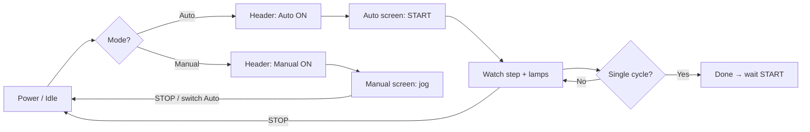

# Palletizer — HMI Control Organization

**Panel:** WinCC / Comfort Panel (or Unified)  
**PLC FB:** `FB_Palletizer` v2.1  
**Tag source:** `scl/Zone_4b_Kunststoff_Palletizer_RFID/PLC_Tags_Palletizer.csv` / `.xlsx`  
**Instanzen:** `4A_Metal` und `4B_Plastic` (jeweils eigener FB-Instanz-DB + eigene HMI-Tags)

---

## 1. HMI structure (screens)

Organize the HMI into **4 screens** + a permanent header bar.

```
┌──────────────────────────────────────────────────────────┐
│  HEADER (always visible)                                 │
│  Mode · Status lamps · Step text · Stop                  │
├──────────┬───────────┬────────────┬──────────────────────┤
│  AUTO    │  MANUAL   │  RECIPE    │  DIAGNOSTICS         │
└──────────┴───────────┴────────────┴──────────────────────┘
```

| Screen | Purpose | Who |
|---|---|---|
| **Header** | Mode, lamps, step, global Stop | Always |
| **Auto** | Start / Reset / SingleCycle / counters | Operator |
| **Manual** | Jog actuators + live sensors | Setup / maintenance |
| **Recipe** | Times + assemblies per layer | Supervisor |
| **Diagnostics** | Busy/Done/sensors/actuators raw | Technician |

> Für Zone 4 werden diese Screens **zweimal** verwendet (4A und 4B), entweder als:
> 1) zwei Subscreens/Popup-Container in einem Zone-4-Bild, oder  
> 2) zwei getrennte Bilder `Zone4A_Palletizer` und `Zone4B_Palletizer`.

---

## 1.1 Instanzkonzept (wichtig)

Für das Gesamt-HMI dürfen 4A und 4B **keine gemeinsamen M-Adressen** nutzen.  
Verwende pro Instanz einen eigenen Tag-Präfix:

- `Z4A_*` für Metal-Palettierer
- `Z4B_*` für Plastic-Palettierer

Beispiel:

- `Z4A_HMI_Start`, `Z4A_HMI_Stop`, `Z4A_HMI_Auto`
- `Z4B_HMI_Start`, `Z4B_HMI_Stop`, `Z4B_HMI_Auto`

Die Objektstruktur bleibt identisch, nur Tag-Bindings unterscheiden sich je Instanz.

---

## 2. Tag groups (logical organization)

Use these groups in WinCC (folders / HMI tag tables) — same names as PLC tags.

| Group | PLC tags | Direction | Screen |
|---|---|---|---|
| **Cmd** | `HMI_Start`, `HMI_Stop`, `HMI_Reset`, `HMI_Auto`, `HMI_SingleCycle` | HMI → PLC | Header + Auto |
| **Man** | `Man_Emit_*` … `Man_Warning_Light` | HMI → PLC | Manual |
| **Lamp** | `HMI_Lamp_Ready` … `HMI_Lamp_Manual` | PLC → HMI | Header |
| **Info** | `HMI_Step_Text_ID`, `HMI_Cycle_Count`, `State`, `Assembly_Count` | PLC → HMI | Header + Auto |
| **Status** | `Busy`, `Done`, `Stackable_Box_Ready`, `Loading_Box_Active` | PLC → HMI | Auto + Diagnostics |
| **Recipe** | `Belt_Run_Time`, `Plate_Open_Time`, `Unload_Time`, `Assemblies_Per_Layer` | HMI ↔ PLC | Recipe |
| **Sensors** | `Stackable_Box_*`, `Assembled_Part_Present`, `Clamped`, `Plate_Limit`, `Pusher_Limit`, `Elevator_*`, `Elev_*` | PLC → HMI | Manual + Diagnostics |
| **Actuators** | `Warning_Light`, `Emit_*`, `Roller_*`, `Push`…`Move_To_Limit` | PLC → HMI (monitor) | Diagnostics |

Instanzbeispiel:

- 4A Cmd-Gruppe: `Z4A_HMI_Start`, `Z4A_HMI_Stop`, ...
- 4B Cmd-Gruppe: `Z4B_HMI_Start`, `Z4B_HMI_Stop`, ...

---

## 3. Header bar (permanent)

| Object | Type | Tag | Notes |
|---|---|---|---|
| Auto / Manual | Switch | `HMI_Auto` | `1` = Auto, `0` = Manual |
| Lamp Auto | Indicator | `HMI_Lamp_Auto` | Green when Auto |
| Lamp Manual | Indicator | `HMI_Lamp_Manual` | Yellow when Manual |
| Ready | Indicator | `HMI_Lamp_Ready` | Green |
| Running | Indicator | `HMI_Lamp_Running` | Yellow / blink |
| Done | Indicator | `HMI_Lamp_Done` | Blue |
| Stopped | Indicator | `HMI_Lamp_Stopped` | Red |
| Step | Text / IO field | `HMI_Step_Text_ID` | Text list (see §6) |
| **STOP** | Momentary / maintained | `HMI_Stop` | Large, always reachable |

**Visibility rules**

- Manual screen navigation only meaningful when `HMI_Auto = 0`  
- Start on Auto screen only enabled when `HMI_Lamp_Ready = 1`

---

## 4. Screen: AUTO

```
┌─ AUTO ─────────────────────────────────────────┐
│  [ START ]   [ RESET ]   □ Single cycle         │
│                                                 │
│  Step: ████████████████████   (text list)       │
│  Assembly: n / N     Cycles: #####              │
│                                                 │
│  □ Busy   □ Done   □ Box ready   □ Loading box  │
└─────────────────────────────────────────────────┘
```

| Object | Tag | Behaviour |
|---|---|---|
| START | `HMI_Start` | Momentary — rising edge starts cycle |
| RESET | `HMI_Reset` | Momentary — clears Done + cycle count |
| Single cycle | `HMI_SingleCycle` | Switch — stop after one unload |
| Step text | `HMI_Step_Text_ID` | Read-only text list |
| Assembly | `Assembly_Count` | Read-only; show vs `Assemblies_Per_Layer` |
| Cycles | `HMI_Cycle_Count` | Read-only |
| Busy / Done / Box ready / Loading | Status tags | Indicators |

**Enable / interlock (WinCC animations)**

| Object | Enable when |
|---|---|
| START | `HMI_Auto` AND `HMI_Lamp_Ready` AND NOT `HMI_Stop` |
| RESET | always (or when Done) |
| Single cycle | `HMI_Auto` |

---

## 5. Screen: MANUAL

Only active when `HMI_Auto = 0`. Show a banner if Auto is selected: *“Switch to Manual in header”*.

### 5.1 Jog button layout

Group jog buttons by machine zone:

```
┌─ INFEED ──────────┐  ┌─ PALLETIZER ──────────────────────┐
│ Emit box          │  │ Belt +    Belt −                   │
│ Roller            │  │ Chain +   Chain −                  │
└───────────────────┘  │ Push      Turn       Clamp         │
                       │ Open plate                         │
┌─ ELEVATOR ────────┐  └────────────────────────────────────┘
│ Up   Down   Limit │
│ Warning light     │
└───────────────────┘
```

| Zone | Buttons → tags |
|---|---|
| Infeed | `Man_Emit_Stackable_Box`, `Man_Roller_Conveyor` |
| Transport | `Man_Belt_Fwd`, `Man_Belt_Rev`, `Man_Chain_Fwd`, `Man_Chain_Rev` |
| Layer | `Man_Push`, `Man_Turn`, `Man_Clamp`, `Man_Open_Plate` |
| Elevator | `Man_Elevator_Up`, `Man_Elevator_Down`, `Man_Move_To_Limit` |
| Other | `Man_Warning_Light` |

Use **press-and-hold** (momentary) for all jog buttons.  
PLC already interlocks Fwd/Rev pairs.

### 5.2 Sensor indicators (read-only)

| Indicator | Tag |
|---|---|
| Box present | `Stackable_Box_Present` |
| Box at palletizer | `Stackable_Box_At_Palletizer` |
| Part present | `Assembled_Part_Present` |
| Clamped | `Clamped` |
| Plate closed | `Plate_Limit` |
| Pusher limit | `Pusher_Limit` |
| Elevator moving | `Elevator_Moving` |
| Elev back / front | `Elev_Back_Limit` / `Elev_Front_Limit` |

---

## 6. Screen: RECIPE

| Field | Tag | Default | Unit |
|---|---|---|---|
| Belt run time | `Belt_Run_Time` | 1.5 | s (Time) |
| Plate open time | `Plate_Open_Time` | 1.0 | s |
| Unload time | `Unload_Time` | 3.0 | s |
| Assemblies / layer | `Assemblies_Per_Layer` | 2 | — |

**Access:** password / user level recommended (Supervisor).  
Writeable I/O fields → PLC `%MD20`…`%MW32`.

---

## 7. Screen: DIAGNOSTICS

| Section | Content |
|---|---|
| Process flags | `Busy`, `Done`, `State`, `Loading_Box_Active`, `Stackable_Box_Ready` |
| Sensors | All §5.2 tags |
| Actuators (monitor) | `Emit_*`, `Roller_*`, `Push`…`Move_To_Limit`, `Warning_Light` |
| Mode | `HMI_Auto`, `HMI_SingleCycle`, `Auto_Run` via lamps |

Optional: show `%I` / `%Q` address next to each bit for Factory I/O mapping checks.

---

## 8. Operator flow



1. Set **Auto** in header → Ready lamp ON  
2. Optional: enable **Single cycle**  
3. Press **START** → Running lamp ON, step text advances  
4. **STOP** anytime → outputs off, Idle  
5. **RESET** clears Done / cycle counter  
6. For setup: switch **Manual** → use jog + sensor lamps  

---

## 9. WinCC text list — Step

**HMI object:** Symbolic I/O field → `HMI_Step_Text_ID`  
**Text list name:** e.g. `TL_Palletizer_Step`

| Value | Text (EN) | Text (DE) |
|---|---|---|
| 0 | Idle | Idle / Bereit |
| 10 | Emit / roller | Ausgeben / Rollenbahn |
| 12 | Chain load | Kette laden |
| 20 | Elevator up | Aufzug hoch |
| 30 | Wait assembly | Warte Bauteil |
| 32 | Belt feed | Band vor |
| 40 | Push | Schieben |
| 50 | Clamp | Klemmen |
| 60 | Open plate | Platte öffnen |
| 70 | Elevator down | Aufzug runter |
| 72 | Unload | Entladen |

---

## 10. Color / object conventions

| Meaning | Color | Used for |
|---|---|---|
| Ready / OK | Green | `HMI_Lamp_Ready`, Auto mode |
| Running | Yellow | `HMI_Lamp_Running`, Manual mode |
| Done | Blue | `HMI_Lamp_Done` |
| Stop / fault | Red | `HMI_Lamp_Stopped`, STOP button |
| Jog active | Orange border | Held `Man_*` button |
| Sensor ON | Lime fill | Sensor indicators |

---

## 11. Binding checklist (WinCC → PLC)

### Instanzaufteilung (empfohlen)

Beispiel für nicht überlappende Adressräume:

- **Zone 4A:** `%M40...`, `%MW44...`, `%MD52...`
- **Zone 4B:** `%M80...`, `%MW84...`, `%MD92...`

Alternative (besser): komplett symbolische DB-Bindung ohne feste Merkeradressen.

### Commands (write)

- [ ] `HMI_Start` `%M0.0`  
- [ ] `HMI_Stop` `%M0.1`  
- [ ] `HMI_Reset` `%M0.2`  
- [ ] `HMI_Auto` `%M0.3`  
- [ ] `HMI_SingleCycle` `%M0.4`  
- [ ] All `Man_*` `%M1.0`…`%M2.5`  

### Feedback (read)

- [ ] Lamps `%M11.0`…`%M11.5`  
- [ ] `HMI_Cycle_Count` `%MW16`  
- [ ] `HMI_Step_Text_ID` `%MW18`  
- [ ] `Busy` / `Done` / status `%M10.x`  
- [ ] `State` `%MW12`, `Assembly_Count` `%MW14`  

### Recipe (read/write)

- [ ] `%MD20`, `%MD24`, `%MD28`, `%MW32`  

Für 4A/4B je Instanz separat prüfen:

- [ ] 4A: alle Cmd/Man/Lamp/Info/Recipe-Tags gebunden
- [ ] 4B: alle Cmd/Man/Lamp/Info/Recipe-Tags gebunden
- [ ] keine Adressüberschneidung mit Zone 3 / Hochregal / anderen Bereichen

---

## 12. Summary — what lives where

| Need | Screen | Tags |
|---|---|---|
| Run production | Auto + Header | Cmd + Lamp + Info |
| Setup / recover jam | Manual + Header | Man + Sensors |
| Tune cycle times | Recipe | Recipe |
| Debug I/O | Diagnostics | Status + Sensors + Actuators |
| Emergency stop UI | Header | `HMI_Stop` |
