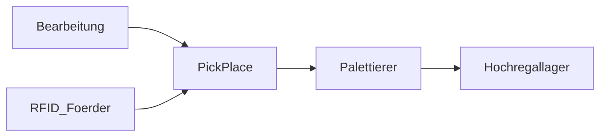

# Abschlussarbeit — Dokumentation

**Thema:** Entwicklung und Simulation einer automatisierten Fertigungs- und Lageranlage mit RFID-gestützter Produktverfolgung in **TIA Portal V20** und **Factory I/O**

**Teilnehmer:** Dereje Hailemariam · Berlin, 29.06.2026  
**Freigabe:** [PDF](01_Projektgrundlagen/Freigabedokument_Abschlussarbeit_Dereje_Hailemariam.pdf) · [Zusammenfassung](01_Projektgrundlagen/Freigabe_Zusammenfassung.md)

---

## Gliederung

| Kap. | Ordner | Inhalt |
|---|---|---|
| **1** | [01_Projektgrundlagen](01_Projektgrundlagen/) | Freigabe, Organisation, Maschinengrenzen, Verwendung |
| **2** | [02_Sicherheit](02_Sicherheit/) | EN ISO 12100 / 13849 (Phasen 4–11) |
| **3** | [03_Technik](03_Technik/) | SPS, HMI-TP, Netzwerk, E/A (gesamt) |
| **4** | [04_Subsysteme](04_Subsysteme/) | Pick & Place · Palettierer · Hochregallager |
| **5** | [05_CE_Dokumentation](05_CE_Dokumentation/) | CE-Paket (später) |

---

## Factory (Subsysteme / Repos)

| Zone | Subsystem | Repo | Doku |
|---|---|---|---|
| 3 | Two-Axis Pick & Place | dieses Repo | [04_Subsysteme/PickPlace_2Axis](04_Subsysteme/PickPlace_2Axis/) |
| 4 | Palettierer | dieses Repo | [04_Subsysteme/Palettierer](04_Subsysteme/Palettierer/) |
| 5 | Hochregallager | `Hochregallager-SCL` | [04_Subsysteme/Hochregallager](04_Subsysteme/Hochregallager/) |
| 1–2 | Bearbeitung Metall/Kunststoff | *folgt* | — |

**Nicht im Scope:** Wasserverbrauch / Wasserwirtschaft.

---

## Status / nächste Schritte

| Erledigt | Offen (nächste Lieferungen) |
|---|---|
| Freigabe + Projektgrundlagen | Lastenheft / Pflichtenheft |
| Palettierer SCL + HMI | Anlagenübersicht / Materialfluss |
| Pick & Place FB | RFID-Konzept |
| Hochregallager (Schwester-Repo) | Sicherheit Phase 4–11 ausfüllen |
| Doku-Gerüst | Gesamt-HMI, E/A-Liste, CE |

**Arbeitsweise:** Du lieferst das nächste Dokument oder den nächsten Code → wir ordnen es hier ein und arbeiten weiter.
