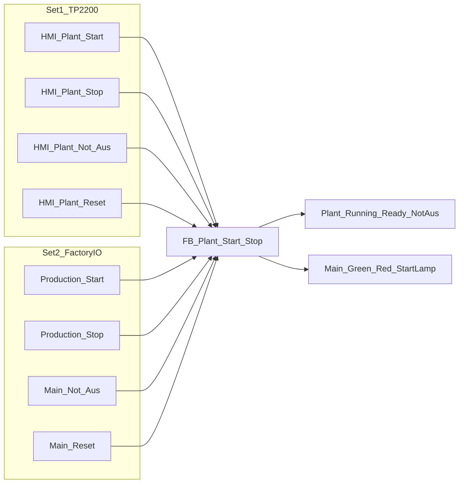

# FB_Plant_Start_Stop — FUP

**TIA:** Programmbausteine → Add new block → Function block · Language **FUP** · Name `FB_Plant_Start_Stop`  
**Instanz-DB:** `FB_Plant_Start_Stop_DB`  
**Tags:** [`PLC_Tags_Plant_Start_Stop.csv`](PLC_Tags_Plant_Start_Stop.csv)

Zwei **gleichwertige** Bedienstellen, im FB **ODER**-verknüpft. Eine SPS, nicht zwei Freigaben.

Prozess-Not-Aus. **Nicht** das F-Programm der 1518F. Adressen: [`PLC_TAG_ADDRESS_FIXES.md`](PLC_TAG_ADDRESS_FIXES.md).

## Set 1 — HMI (`HMI_Plant_*`, Merkers)

TP Übersicht. WinCC: Press SetBit, Release ResetBit.

| Funktion | Tag | Addr |
|---|---|---|
| Start | `HMI_Plant_Start` | `%M58.0` |
| Stop | `HMI_Plant_Stop` | `%M58.1` |
| Not-Aus | `HMI_Plant_Not_Aus` | `%M58.2` |
| Reset | `HMI_Plant_Reset` | `%M58.3` |
| Lampe läuft | `Plant_Running` | `%M58.4` |
| Lampe Not-Aus | `Plant_Not_Aus` | `%M58.5` |
| Enable | `Plant_Enable` | `%M58.6` |
| Lampe bereit | `Plant_Ready` | `%M58.7` |

## Set 2 — Factory I/O (Taster + Stack-Lights)

Scene-Buttons und Lampen. **Nicht** an die HMI binden.

| Funktion | Tag | Addr |
|---|---|---|
| Start | `Production_Start` | `%E9.1` |
| Stop | `Production_Stop` | `%E9.2` |
| Not-Aus | `Main_Not_Aus` | `%E9.3` |
| Reset | `Main_Reset` | `%E9.4` |
| Grün | `Main_Green_Stack_Light` | `%A15.5` := `Plant_Running` |
| Rot | `Main_Red_Light` | `%A15.6` := `Plant_Not_Aus` |
| Start-Lampe | `Main_Start_Button_Light` | `%A15.7` := `Plant_Ready` |

Nicht `%E18` / `%A18` / `%M100`.

## OB1 — nur einmal, ganz am Ende

Nach NW 1–29, vor `"OB100_Startup_Init" := FALSE`. Call: [`OB1_Plant_Start_Stop.scl`](OB1_Plant_Start_Stop.scl).

## Interface

| Abschnitt | Name | Typ |
|---|---|---|
| Input | `HMI_Start` `HMI_Stop` `HMI_Not_Aus` `HMI_Reset` | Bool |
| Input | `FIO_Start` `FIO_Stop` `FIO_Not_Aus` `FIO_Reset` | Bool |
| Input | `Startup_Init` | Bool |
| Output | `Plant_Running` `Plant_Not_Aus` `Plant_Enable` `Plant_Ready` | Bool |
| Output | `FIO_Green` `FIO_Red` `FIO_StartLamp` | Bool |
| InOut | `Not_Aus` `Not_Aus_W2` | Bool |

Static: vier `P_TRIG`, zwei `SR`.

## FUP-Netze

### NW 1 — OR beider Sätze, dann Flanken

- `#Start` := `#HMI_Start` OR `#FIO_Start`
- `#Stop` := `#HMI_Stop` OR `#FIO_Stop`
- `#Estp` := `#HMI_Not_Aus` OR `#FIO_Not_Aus`
- `#Rst` := `#HMI_Reset` OR `#FIO_Reset`

`P_TRIG` auf `#Start` / `#Stop` / `#Estp` / `#Rst`.

### NW 2 — SR Not-Aus

- Set = Flanke Estp
- Reset = Flanke Rst **AND NOT** `#Estp` (Pilz noch gedrückt → kein Reset)
- Q → `Plant_Not_Aus`

### NW 3 — SR Produktion läuft

- Set = Flanke Start **AND NOT** `Plant_Not_Aus`
- Reset = Flanke Stop **OR** `Plant_Not_Aus` **OR** `Startup_Init`
- Q → `Plant_Running`

### NW 4 — Enable / Ready / FIO-Lampen

- `Plant_Enable` := Running AND NOT Not-Aus
- `Plant_Ready` := NOT Running AND NOT Not-Aus
- `FIO_Green` := `Plant_Running`
- `FIO_Red` := `Plant_Not_Aus`
- `FIO_StartLamp` := `Plant_Ready`

HMI-Lampen sind dieselben Merkers `Plant_Running` / `Plant_Not_Aus` / `Plant_Ready`.

### NW 5 — Hochregal

- `Not_Aus` := `Plant_Not_Aus`
- `Not_Aus_W2` := `Plant_Not_Aus`

### NW 6 — Auto aus, wenn nicht Enable

- `"Mode_Auto"` / `"Mode_Auto_W2"` := FALSE
- `"4a_HMI_Start"` / `"4b_HMI_Start(1)"` := FALSE

### NW 7 — Q-Inhibit (last write)

EN = NOT `Plant_Enable`: `MOVE` `16#00` nach `%AB0` … `%AB15`.

Danach FIO-Lampen und Sirenen wieder setzen (Inhibit löscht `%A15`):

- `"5b_Alarm Siren 2"` := `Plant_Not_Aus`
- `"5a_Alarm Siren 0"` := `Plant_Not_Aus`
- `FIO_Green` / `FIO_Red` / `FIO_StartLamp` wie NW 4

## TIA-Check

1. Beide Tag-Gruppen anlegen (CSV).
2. FB-Pins: 4× HMI + 4× FIO, nicht nur HMI.
3. Factory I/O Driver: Buttons `%E9.1–.4`, Lights `%A15.5–.7`.
4. HMI nur `%M58.*`.
5. Aufruf nach NW 29. F-Programm nicht anfassen.

## OB100 (STOP → RUN)

Einmal, **nicht** zyklisch. Paste: [`OB100_Startup.scl`](OB100_Startup.scl).

- `"OB100_Startup_Init" := TRUE` → FB löscht `Plant_Running` (SR Reset), Hochregal-Automatik einmal Reset.
- **Set 1** HMI-Taster und Status `%M58.0–.7` auf FALSE (keine Produktion aus dem letzten RUN).
- **Set 2** Lampen `%A15.5–.7` AUS. Taster `%E9.1–.4` **nicht** beschreiben.
- Letztes OB1-Netz: `"OB100_Startup_Init" := FALSE`.

Erstes zyklisches Scan: FB setzt `Plant_Ready` wenn kein FIO-Not-Aus ansteht. Start nur nach Taster HMI **oder** FIO.
